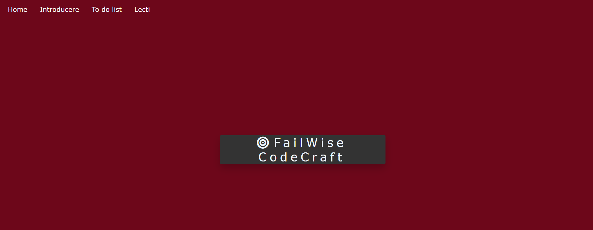

# 📘 FailWise-CodeCraft – Learn C++ through creativity, mistakes, and growth

## 🖼️ Preview

Here are a couple of screenshots from the current version of the website:

---

---

## 🌟 Description

**CodeCraft** is a prototype educational website built as part of my high school graduation thesis. Inspired by platforms like W3Schools, its purpose is to help students learn C++ in a simple, creative, and motivational environment.

The homepage features an inspirational quote that encourages learners to embrace mistakes as an essential part of personal and intellectual growth. The name *"CodeCraft"* comes from two core beliefs:

- 💡 Coding is a **craft**, shaped by **creativity** and curiosity  
- ❌ Making **mistakes** is not failure—it's a smart step toward becoming better

---

## 🔧 Current Features

- 📄 Homepage with inspirational message  
- 🧠 Beginner-friendly structure for learning C++  
- 🎨 Custom HTML/CSS template created from scratch

---

## 🚧 Work in Progress

This is an early prototype. I plan to:

- Add more lessons and interactive content  
- Introduce small exercises and coding challenges  
- Improve design and mobile responsiveness  
- Possibly integrate JS-based quizzes or C++ code compilers
 
---

## 📬 Contact

Feel free to reach out if you have suggestions or ideas!  
📧 *[Add your email or social media link here]*

---

## 📄 License

All rights reserved. This project is for personal and educational use only.